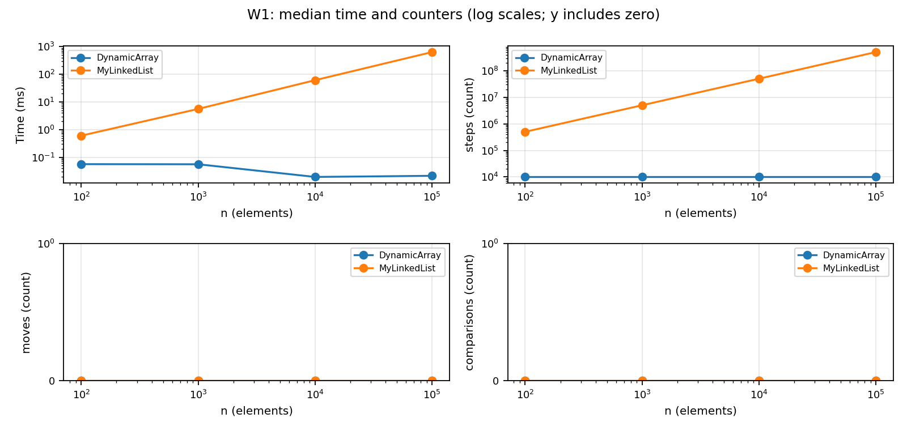
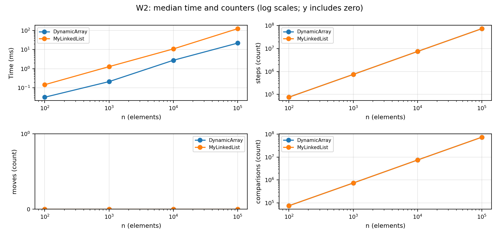
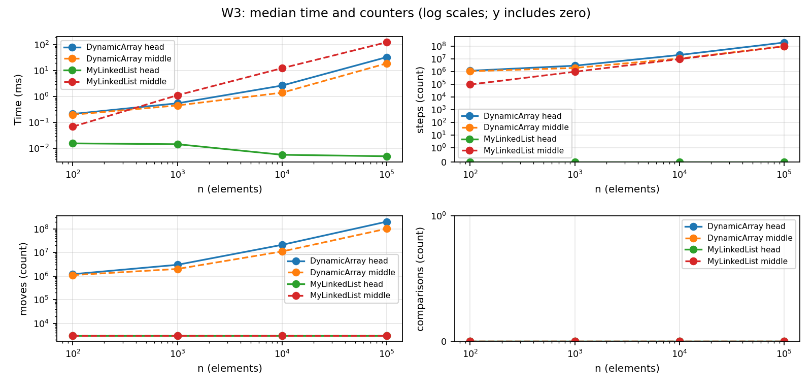
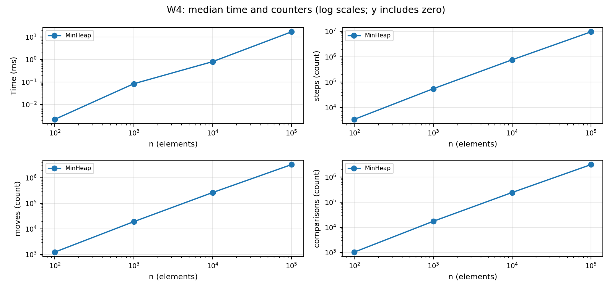

# Assignment 2 - Data Structures

NIYALOV YERKEBULAN - SE 2526

## 1. Implementation and complexity

DynamicArray and MinHeap use int arrays with initial capacity 4 and double
capacity when full. MyLinkedList is singly linked and has head and tail.
All stored values are primitive int. The two lists implement IntList.
The structures use no standard collections. Random and Locale are used only
by the benchmark; reference collections are used only in tests.

Here n is the current size, and auxiliary space excludes existing storage.
For indexed operations the average assumes uniformly chosen valid indices.
For search it assumes a fixed nonzero miss probability and uniformly located
hits in distinct data. Empty cases take constant time. Theta is a tight bound;
O is an upper bound; Omega is a lower bound. Every Theta bound also gives
matching O and Omega bounds.

| Operation | Best | Average / amortized | Worst single call | Extra space | Reason |
| --- | --- | --- | --- | --- | --- |
| Array add(x) | Theta(1) | Theta(1) amortized | Theta(n) | O(n) | Doubling copies n values; copies sum geometrically. |
| Array add(i,x) | Theta(1) | Theta(n) | Theta(n) | O(n) | Shifts n-i values and may resize. |
| Array remove(i) | Theta(1) | Theta(n) | Theta(n) | Theta(1) | Shifts n-i-1 values; no shrinking. |
| Array get(i) | Theta(1) | Theta(1) | Theta(1) | Theta(1) | Direct array access. |
| Array contains(x) | Theta(1) | Theta(n) | Theta(n) | Theta(1) | Scans until a match or the end. |
| List add(x) | Theta(1) | Theta(1) | Theta(1) | Theta(1) | The tail avoids traversal. |
| List add(i,x) | Theta(1) | Theta(n) | Theta(n) | Theta(1) | Head/tail are fast; otherwise find predecessor. |
| List remove(i) | Theta(1) | Theta(n) | Theta(n) | Theta(1) | Head is fast; otherwise find predecessor. |
| List get(i) | Theta(1) | Theta(n) | Theta(n) | Theta(1) | Follows i links from head, even for the last index. |
| List contains(x) | Theta(1) | Theta(n) | Theta(n) | Theta(1) | Checks nodes in order. |
| Heap insert(x) | Theta(1) | O(log n) amortized | Theta(n) | O(n) | Bubble-up is O(log n); a resize copies n. |
| Heap peekMin() | Theta(1) | Theta(1) | Theta(1) | Theta(1) | Reads the root. |
| Heap extractMin() | Theta(1) | Theta(log n) | Theta(log n) | Theta(1) | Sifts down; equal values can stop immediately. |

Heap extraction average assumes a heap formed from a random permutation of
distinct values. The insertion entry is a distribution-independent amortized
upper bound, not a claimed tight expected bound: without resizing, random
independent keys can have expected constant bubble-up distance. A non-growing
insertion has worst-case Theta(log n); growing insertions take Theta(n).
For array append, the amortized entry is not a probabilistic average: a full
array still costs Theta(n) on that particular call. The space upper bounds
O(n) for growing operations are Theta(n) on resize and Theta(1) otherwise.
List storage is Theta(n); array/heap storage is Theta(peak size), since neither
shrinks. The simple size(), metrics() and reset() helpers take Theta(1).

## 2. Two loop invariant proofs

### DynamicArray.contains(value)

**Invariant.** Before iteration i, 0 <= i <= size, and none of the elements at
indices 0 through i-1 equals value. The array contents and size are unchanged.

**Initialization.** Before the first iteration i=0. The checked prefix is empty,
so it contains no matching element.

**Maintenance.** The loop compares data[i] with value. If they are equal, it
returns true and has found an actual element. Otherwise index i is also known
not to match; incrementing i extends the checked prefix by one element. Reading
the array and updating counters do not change the stored values.

**Termination.** Either a match returns true, or i reaches size. In the second
case the prefix is the whole array and the invariant says value is absent,
so false is correct. Each unsuccessful iteration increments i, so the loop ends.

**Conclusion.** The method returns true exactly when a stored value matches.
An empty array correctly returns false without entering the loop.

### DynamicArray.remove(index)

Let A be a snapshot before removal and let s be the original size. The bounds
check has established 0 <= index < s. The method saves A[index] as result.

**Invariant.** Before each shift iteration i, index <= i <= s-1. Positions
before index still equal A[k]. For index <= k < i, data[k] equals A[k+1].
For i <= k < s, data[k] still equals A[k]. The size is still s and result
still equals the removed value A[index].

**Initialization.** Initially i=index. The already-shifted interval is empty
and the whole array still matches A, so the invariant holds.

**Maintenance.** Since i < s-1, data[i+1] is valid and still equals A[i+1].
The assignment copies it into data[i]. After i is incremented, the shifted
interval includes this position and the remaining suffix is unchanged.
No earlier position is overwritten.

**Termination.** The loop ends at i=s-1. Every position from index through
s-2 now equals its original successor. The code then decreases size to s-1,
excluding the unused last cell. The loop ends because i increases toward s-1.

**Conclusion.** The live array equals the old sequence with exactly A[index]
removed, all remaining elements stay in order, and the returned value is the
removed element. Removing the last or the only element needs no shift.

## 3. Random access and search

W1 makes 10,000 get calls after filling. At n=100,000 the array takes
0.021300 ms and 10,000 steps; the list takes 636.776200 ms and 504,930,938
steps. Array steps stay constant because the number of queries is fixed.
List steps grow roughly linearly with n because an index averages near n/2.
Both structures receive identical indices. Moves and element comparisons
are zero for both: bounds and loop conditions are not element comparisons.

W2 has 1,000 queries: 500 selected from input and 500 negative absent values.
At n=100,000 both structures perform 73,970,266 element comparisons.
The array takes 21.888500 ms versus 124.760100 ms for the list.
Array steps count inspected cells, while list steps count following next.
A successful list search stops before following the final next link, so its
step count is exactly 500 below the array's count. Duplicate input values can
make a search stop earlier than the chosen source index.

Each workload chart has time, steps, moves and comparisons panels. The x-axis
is logarithmic. Positive y-series use a log scale; panels containing zeros use
a symmetric log scale with a linear region near zero. Overlapping zero lines are expected.

## 4. Insert/remove and priority processing

W3 first inserts 1,000 values, then removes 1,000, always at index 0 (head)
or the fixed original n/2 (middle). This returns the structure to size n.
At n=100,000, head takes 33.539600 ms for the array and 0.005000 ms for
the list. Middle takes 19.287300 ms and 125.925700 ms respectively.
The head list case has zero traversal steps but 3,000 pointer updates:
two per insertion and one per removal. The middle list traverses 99,999,000
links; the array shifts 100,999,000 values. Similar counts do not imply
similar time. At the two smallest n values, array growth adds copying costs.

W4 inserts n values and then extracts n minima. Each run verifies the full
output is non-decreasing after the timer stops. At n=100,000 it takes
16.747600 ms, with 9,505,677 reads, 3,287,427 moves and 3,059,125 comparisons.
The total workload has an O(n log n) upper bound, and typical random input
has Theta(n log n) extraction work. Only MinHeap is shown because W4 requires
no list comparison. Resizing copies are included in its counters and time.

## 5. Measurement details and discussion

The run used Windows, Intel Core i5-12450H, Oracle JDK 21.0.7 and Maven 3.9.9.
For each n=100, 1,000, 10,000, 100,000, new Random(42) generates nonnegative
values below 1,000,000. Queries are prepared outside timing and reused.
Ten general warm-up repetitions at n=10,000 precede the experiment. Each
case then has two discarded runs and five measured fresh-structure runs.
System.nanoTime measures elapsed time; the median of five is written to CSV.
W1-W3 exclude filling and reset counters after filling; W4 includes all heap
operations. The timer includes counter updates and workload loops, but excludes
input generation, CSV writing and output validation. A volatile checksum keeps
returned values observable. All 36 cases are included.

Counters are long fields updated inside the methods. A step means one int-array
cell read or one traversal to next (including the final null in failed search).
A move means an existing array element copied/shifted, or one assignment to a
list's head, tail or next field. Replacing the heap root counts as one move;
a swap counts as two moves and two reads. Fresh value writes, default null
initialization, local variables, size changes and array-reference replacement
are not moves. Link rewiring counts as moves, separately from cursor traversal.
Comparisons count only stored-value comparisons, not indices, sizes or nulls.

### Discussion (12 sentences)

1. DynamicArray gets an element by calculating one address, while MyLinkedList must follow links from the head.
2. This explains the large W1 difference and the different step growth.
3. During a sequential scan, adjacent array integers share cache lines, which gives spatial locality and helps prefetching.
4. Linked nodes may live far apart, and the next address depends on reading the current node's pointer.
5. This pointer chasing can delay the CPU even when two scans have similar step counts.
6. Node object headers, references and alignment also use space beyond the stored int.
7. Creating many nodes puts more work on allocation and the garbage collector, although this experiment does not separately measure GC or memory usage.
8. W2 therefore supports the locality explanation, but timing alone does not prove how many cache misses occurred.
9. MyLinkedList is a good choice for frequent head edits and tail appends, which take constant time in this implementation.
10. An arbitrary middle edit is still linear because this indexed API must first find the predecessor.
11. MinHeap is useful when the next job should always have the smallest priority, with constant-time peeking and logarithmic worst-case extraction.
12. Very short timings still vary with JIT compilation, scheduling and CPU frequency, so the counters and scaling trends are more reliable than any single speed ratio.

### Checks

All 10 JUnit 5 tests passed, with zero failures and errors. Random list operations
are checked against ArrayList, and heap operations against PriorityQueue.
Tests cover empty/single structures, duplicates, growth, first/last indices,
invalid indices, heap order after every update, sorted extraction and exact
small-case counters. The local history has all four required feature branches
merged into main; the release is tagged v1.0. GitHub upload remains a submission
step because no remote repository was supplied.
